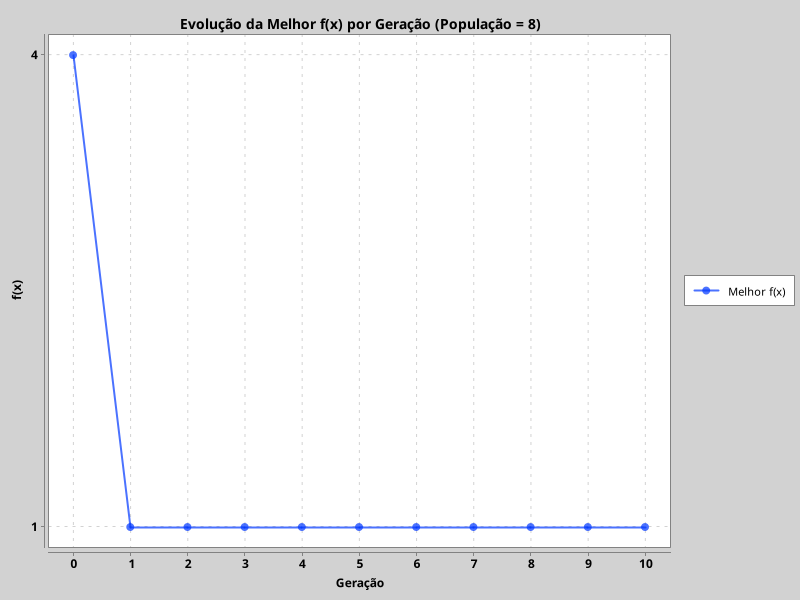

# Algoritmo Genético para Minimização Quadrática

## 1. Descrição Geral do Projeto
- Projeto Java acadêmico que demonstra como Algoritmos Genéticos (AGs) podem resolver um problema de otimização contínua simples: minimizar a função quadrática \( f(x) = x^2 - 4x + 4 \) no intervalo discreto [-15, 15].
- O programa executa diversas simulações com populações de tamanhos diferentes (4, 8 e 12 indivíduos) para observar o comportamento evolutivo, registrando estatísticas em CSV e produzindo um gráfico automático.
- Os AGs são aplicados como um processo iterativo que gera populações de soluções codificadas em binário, avalia sua aptidão, seleciona as melhores, realiza crossover e mutação, e repete por até 10 gerações ou até convergir para valores de alta aptidão.
- No contexto deste código, cada execução completa gera: (i) `resultados_populacoes.csv` com estatísticas agregadas de 100 execuções por tamanho populacional, (ii) `evolucao_pop8.csv` com a trajetória do melhor indivíduo geração a geração para população 8, e (iii) `grafico_pop8.png` com a curva de convergência.

## 2. Modelos Generativos e AGs
- **O que é um modelo generativo?** É uma técnica de IA capaz de produzir novos exemplos plausíveis a partir de um conjunto de regras ou dados, aprendendo ou explorando distribuições para gerar saídas inéditas (textos, imagens, soluções).
- **AGs como IA generativa baseada em evolução:** Aqui, a geração de novas soluções decorre de operadores inspirados na biologia (crossover e mutação). A cada geração, indivíduos inéditos são criados, avaliados e selecionados, constituindo um modelo generativo que explora o espaço de busca.
- **Evolutivo x Neural:** Modelos generativos neuronais (como GPT ou diffusion models) aprendem parâmetros via gradiente em grandes redes profundas, enquanto modelos evolucionários, como este AG, não requerem gradientes nem datasets massivos: eles geram e testam soluções com base em aptidão. As redes neurais produzem amostras estatisticamente coerentes com dados vistos; os AGs evoluem populações rumo a soluções ótimas utilizando competição e recombinação.
- **Por que AGs são modelos generativos?** Porque cada iteração cria candidatos inéditos ao recombinar genes e aplicar mutações. Mesmo com representações simples, o algoritmo gera novas sequências binárias que representam valores de \(x\) ainda não testados, permitindo explorar e explotar o espaço de busca.

## 3. Detalhamento do Algoritmo Genético Utilizado
### Codificação binária
| Aspecto | Descrição |
| --- | --- |
| Tamanho do cromossomo | `NUM_BITS = 5` |
| Bit 0 | Sinal (`0` = negativo, `1` = positivo) |
| Bits 1-4 | Magnitude em binário (0 a 15) |
| Intervalo obtido | \([-15, +15]\) |

### Função objetivo
- Fórmula destacada: $$ f(x) = x^2 - 4x + 4 $$
- Trata-se de uma parábola com mínimo global em \(x = 2\), valor mínimo \(f(2) = 0\).

### Função de aptidão
- Definição: $$\text{fitness}(x) = -f(x) $$
- Como desejamos **minimizar** \(f(x)\), basta maximizar \(-f(x)\). Indivíduos com menor \(f(x)\) recebem maior aptidão.

### População inicial
- Criada por `createPopulation`, preenchendo cada gene com `0` ou `1` escolhidos uniformemente. Isso assegura diversidade inicial para todas as execuções.

### Seleção
- Seleção por torneio de tamanho 2 (`tournament`): sorteiam-se dois indivíduos e o de maior aptidão vence, promovendo pressão seletiva leve.

### Crossover
- Crossover de 1 ponto (`crossover`): corta-se em posição aleatória \(\in [1, NUM\_BITS-1]\) e trocam-se os sufixos para formar dois filhos. Isso permite recombinar sinal e magnitude.

### Mutação
- Mutação pontual (`mutate`): cada filho tem 5% de chance (`rate = 0.05`) de ter um gene invertido, fomentando diversidade residual.

### Gerações e execuções
- `MAX_GENERATIONS = 10`: cada execução evolui no máximo 10 gerações.
- `NUM_EXECUTIONS = 100`: para cada tamanho de população, o algoritmo roda 100 vezes e registra apenas a melhor aptidão de cada execução, permitindo estatísticas robustas.

## 4. Estatísticas Geradas (`resultados_populacoes.csv`)
O arquivo CSV possui uma linha por tamanho populacional e quatro colunas calculadas a partir das 100 execuções. Interpretação:

| Coluna | Significado | Como interpretar |
| --- | --- | --- |
| Média da Melhor Aptidão | Média das melhores aptidões (maiores valores de `fitness`) obtidas nas 100 execuções | Indica o desempenho médio do AG para aquele tamanho populacional |
| Mediana da Melhor Aptidão | Mediana das melhores aptidões | Mostra a robustez ao ruído, mitigando outliers |
| Melhor das Melhores | Melhor aptidão entre todas as execuções | Demonstra o cenário mais favorável alcançado |
| Pior das Melhores | Pior valor entre as melhores aptidões de cada execução | Revela o cenário menos favorável; valores próximos à média indicam consistência |

> **Interpretação geral:** quanto mais próximas estiverem média, mediana e pior-desempenho do valor teórico máximo (0 para `-f(x)`), mais consistente é a convergência. O CSV é salvo automaticamente como `resultados_populacoes.csv` na raiz do projeto.

## 5. CSV da Evolução da População com 8 Indivíduos (`evolucao_pop8.csv`)
- Gerado ao executar o AG com `populationSize = 8` e `trackPerGen = true`.
- Colunas:
  - `Geracao`: índice da geração (0 inicial até 10).
  - `MelhorX`: valor inteiro representando o melhor indivíduo naquela geração.
  - `f(x)`: valor da função objetivo para `MelhorX`.
  - `Aptidao`: simplesmente `-f(x)`, usado internamente para seleção.
- A leitura sequencial do CSV mostra a convergência: valores de `f(x)` tendem a diminuir e `MelhorX` aproxima-se de 2, caracterizando evolução em direção ao ótimo global.

## 6. Gráfico Gerado Automaticamente (`grafico_pop8.png`)
- Construído por `generateEvolutionChart` utilizando **XChart** (`XYChartBuilder`).
- Eixo X: gerações (0 a 10), mostrando a linha do tempo evolutiva.
- Eixo Y: melhor valor da função objetivo `f(x)` em cada geração.
- A curva resultante tipicamente decresce e estabiliza próximo de 0, evidenciando convergência.
- XChart salva automaticamente em PNG com resolução 800x600. Pré-visualização:



## 7. Estrutura do Projeto
```
.
├── pom.xml
├── src/
│   └── main/java/com/atividade/Main.java
├── resultados_populacoes.csv        # estatísticas agregadas
├── evolucao_pop8.csv                # evolução geração a geração
├── grafico_pop8.png                 # gráfico automático
├── target/                         # artefatos Maven
└── output/                         # pasta sugerida para guardar execuções adicionais
```
> Recomenda-se utilizar a pasta `output/` (ou outra de sua escolha) para guardar versões históricas dos CSVs/PNGs, evitando sobrescrever resultados importantes.

## 8. Como Executar o Projeto
### 8.1 Sem Maven
1. **Obtenha o JAR do XChart 3.8.3** e salve em `libs/xchart-3.8.3.jar`.
2. Compile o código:
   ```bash
   mkdir -p out \
     && javac -cp libs/xchart-3.8.3.jar -d out src/main/java/com/atividade/Main.java
   ```
3. Execute informando o classpath (em Windows substitua `:` por `;`):
   ```bash
   java -cp "out:libs/xchart-3.8.3.jar" com.atividade.Main
   ```
4. Ao final, verifique os arquivos `resultados_populacoes.csv`, `evolucao_pop8.csv` e `grafico_pop8.png` na raiz (ou mova-os para `output/`).

### 8.2 Com Maven
1. Certifique-se de ter o Maven instalado e Java 17.
2. Dependência necessária (já presente no `pom.xml`):
   ```xml
   <dependency>
       <groupId>org.knowm.xchart</groupId>
       <artifactId>xchart</artifactId>
       <version>3.8.3</version>
   </dependency>
   ```
3. Compile e execute:
   ```bash
   mvn clean package
   mvn exec:java -Dexec.mainClass="com.atividade.Main"
   ```
   *Alternativa:* `java -cp target/atv_ia-1.0-SNAPSHOT.jar:~/.m2/repository/org/knowm/xchart/3.8.3/xchart-3.8.3.jar com.atividade.Main`.

## 9. Código Completo para Análise (`Main.java`)
```java
package com.atividade;

import java.io.FileWriter;
import java.io.IOException;
import java.util.Arrays;
import java.util.Locale;
import java.util.Random;

import org.knowm.xchart.BitmapEncoder;
import org.knowm.xchart.XYChart;
import org.knowm.xchart.XYChartBuilder;

public class Main {

    private static final Random RANDOM = new Random();
    private static final int NUM_BITS = 5;
    private static final int MAX_GENERATIONS = 10;
    private static final int NUM_EXECUTIONS = 100;

    public static void main(String[] args) throws Exception {
        Locale.setDefault(Locale.US);

        Main main = new Main();

        int[] populationSizes = { 4, 8, 12 };

        double[][] resultsTable = new double[populationSizes.length][4];

        System.out.println("Gerando tabela e CSV...");

        for (int p = 0; p < populationSizes.length; p++) {

            int popSize = populationSizes[p];
            double[] bestFitnesses = new double[NUM_EXECUTIONS];

            for (int exec = 0; exec < NUM_EXECUTIONS; exec++) {
                GAResult r = main.runGeneticAlgorithm(popSize, false);
                bestFitnesses[exec] = r.bestFitness; // maior aptidão
            }

            double media = mean(bestFitnesses);
            double mediana = median(bestFitnesses);
            double melhor = max(bestFitnesses);
            double pior = min(bestFitnesses);

            resultsTable[p][0] = media;
            resultsTable[p][1] = mediana;
            resultsTable[p][2] = melhor;
            resultsTable[p][3] = pior;
        }

        main.saveResultsTableToCSV("resultados_populacoes.csv", populationSizes, resultsTable);
        System.out.println("✔ CSV gerado: resultados_populacoes.csv");

        // ================================
        // GRÁFICO E CSV DA POPULAÇÃO = 8
        // ================================
        System.out.println("Gerando gráfico e CSV da evolução...");

        GAResult evol = main.runGeneticAlgorithm(8, true);

        main.saveEvolutionToCSV("evolucao_pop8.csv", evol);
        System.out.println("✔ CSV gerado: evolucao_pop8.csv");

        main.generateEvolutionChart("grafico_pop8.png", evol);
        System.out.println("✔ Gráfico gerado: grafico_pop8.png");
    }

    // ================================================================
    // GAResult STRUCT
    // ================================================================

    static class GAResult {
        int bestX;
        double bestFitness;
        int[] bestXPerGeneration;
        double[] bestFxPerGeneration;
    }

    // ================================================================
    // METODO PRINCIPAL DO ALGORITMO GENÉTICO
    // ================================================================

    public GAResult runGeneticAlgorithm(int populationSize, boolean trackPerGen) {
        int[][] population = createPopulation(populationSize);

        int[] decodedX = decode(population);
        double[] fitness = evaluateFitness(decodedX);

        GAResult res = new GAResult();
        if (trackPerGen) {
            res.bestXPerGeneration = new int[MAX_GENERATIONS + 1];
            res.bestFxPerGeneration = new double[MAX_GENERATIONS + 1];
        }

        int bestIndex = indexOfBestFitness(fitness);
        int bestX = decodedX[bestIndex];
        double bestFitness = fitness[bestIndex];

        if (trackPerGen) {
            res.bestXPerGeneration[0] = bestX;
            res.bestFxPerGeneration[0] = f(bestX);
        }

        // Evolução
        for (int gen = 1; gen <= MAX_GENERATIONS; gen++) {

            int[][] newPop = new int[populationSize][NUM_BITS];

            for (int i = 0; i < populationSize; i += 2) {

                int p1 = tournament(fitness);
                int p2 = tournament(fitness);

                int[][] children = crossover(population[p1], population[p2]);
                mutate(children[0]);
                if (i + 1 < populationSize)
                    mutate(children[1]);

                newPop[i] = children[0];
                if (i + 1 < populationSize)
                    newPop[i + 1] = children[1];
            }

            population = newPop;
            decodedX = decode(population);
            fitness = evaluateFitness(decodedX);

            // Atualiza melhor global
            bestIndex = indexOfBestFitness(fitness);
            if (fitness[bestIndex] > bestFitness) {
                bestFitness = fitness[bestIndex];
                bestX = decodedX[bestIndex];
            }

            if (trackPerGen) {
                res.bestXPerGeneration[gen] = bestX;
                res.bestFxPerGeneration[gen] = f(bestX);
            }
        }

        res.bestFitness = bestFitness;
        res.bestX = bestX;
        return res;
    }

    // ================================================================
    // CRIAÇÃO E DECODIFICAÇÃO
    // ================================================================

    public int[][] createPopulation(int n) {
        int[][] pop = new int[n][NUM_BITS];
        for (int i = 0; i < n; i++)
            for (int j = 0; j < NUM_BITS; j++)
                pop[i][j] = RANDOM.nextInt(2);
        return pop;
    }

    public int[] decode(int[][] pop) {
        int[] xs = new int[pop.length];
        for (int i = 0; i < pop.length; i++) {
            int sign = pop[i][0] == 1 ? 1 : -1;
            int val = 0;
            for (int b = 1; b < NUM_BITS; b++) {
                val += pop[i][b] * Math.pow(2, NUM_BITS - 1 - b);
            }
            xs[i] = sign * val;
        }
        return xs;
    }

    // ================================================================
    // AVALIAÇÃO E APTIDÃO
    // ================================================================

    public double f(int x) {
        return x * x - 4 * x + 4;
    }

    public double[] evaluateFitness(int[] decodedX) {
        double[] fit = new double[decodedX.length];
        for (int i = 0; i < decodedX.length; i++)
            fit[i] = -f(decodedX[i]); // aptidão = maximizar
        return fit;
    }

    public int indexOfBestFitness(double[] fitness) {
        int idx = 0;
        for (int i = 1; i < fitness.length; i++)
            if (fitness[i] > fitness[idx])
                idx = i;
        return idx;
    }

    // ================================================================
    // SELEÇÃO, CROSSOVER E MUTAÇÃO
    // ================================================================

    public int tournament(double[] fitness) {
        int a = RANDOM.nextInt(fitness.length);
        int b = RANDOM.nextInt(fitness.length);
        return fitness[a] > fitness[b] ? a : b;
    }

    public int[][] crossover(int[] p1, int[] p2) {
        int cut = 1 + RANDOM.nextInt(NUM_BITS - 1);

        int[][] kids = { Arrays.copyOf(p1, NUM_BITS), Arrays.copyOf(p2, NUM_BITS) };

        for (int i = cut; i < NUM_BITS; i++) {
            int tmp = kids[0][i];
            kids[0][i] = kids[1][i];
            kids[1][i] = tmp;
        }
        return kids;
    }

    public void mutate(int[] ind) {
        double rate = 0.05;
        if (RANDOM.nextDouble() < rate) {
            int g = RANDOM.nextInt(NUM_BITS);
            ind[g] = 1 - ind[g];
        }
    }

    // ================================================================
    // ESTATÍSTICAS
    // ================================================================

    public static double mean(double[] a) {
        double s = 0;
        for (double v : a)
            s += v;
        return s / a.length;
    }

    public static double median(double[] a) {
        double[] x = Arrays.copyOf(a, a.length);
        Arrays.sort(x);
        int mid = x.length / 2;
        return x.length % 2 == 1 ? x[mid] : (x[mid - 1] + x[mid]) / 2;
    }

    public static double max(double[] a) {
        double m = a[0];
        for (double v : a)
            if (v > m)
                m = v;
        return m;
    }

    public static double min(double[] a) {
        double m = a[0];
        for (double v : a)
            if (v < m)
                m = v;
        return m;
    }

    // ================================================================
    // SALVAR TABELA EM CSV
    // ================================================================

    public void saveResultsTableToCSV(String filename, int[] popSizes, double[][] table) throws IOException {
        FileWriter fw = new FileWriter(filename);

        fw.write(
                "Tamanho da População,Média da Melhor Aptidão,Mediana da Melhor Aptidão,Melhor das Melhores,Pior das Melhores\n");

        for (int i = 0; i < popSizes.length; i++) {
            fw.write(popSizes[i] + "," +
                    table[i][0] + "," +
                    table[i][1] + "," +
                    table[i][2] + "," +
                    table[i][3] + "\n");
        }
        fw.close();
    }

    // ================================================================
    // SALVAR EVOLUÇÃO PARA O GRÁFICO
    // ================================================================

    public void saveEvolutionToCSV(String filename, GAResult r) throws IOException {
        FileWriter fw = new FileWriter(filename);

        fw.write("Geracao,MelhorX,f(x),Aptidao\n");

        for (int g = 0; g < r.bestXPerGeneration.length; g++) {
            int x = r.bestXPerGeneration[g];
            double fx = r.bestFxPerGeneration[g];
            double fit = -fx;

            fw.write(g + "," + x + "," + fx + "," + fit + "\n");
        }
        fw.close();
    }

    // ================================================================
    // GERAR GRÁFICO AUTOMÁTICO
    // ================================================================

    public void generateEvolutionChart(String filename, GAResult r) throws Exception {

        double[] gen = new double[r.bestFxPerGeneration.length];
        double[] fx = new double[r.bestFxPerGeneration.length];

        for (int i = 0; i < gen.length; i++) {
            gen[i] = i;
            fx[i] = r.bestFxPerGeneration[i];
        }

        XYChart chart = new XYChartBuilder()
                .width(800)
                .height(600)
                .title("Evolução da Melhor f(x) por Geração (População = 8)")
                .xAxisTitle("Geração")
                .yAxisTitle("f(x)")
                .build();

        chart.addSeries("Melhor f(x)", gen, fx);

        BitmapEncoder.saveBitmap(chart, filename, BitmapEncoder.BitmapFormat.PNG);
    }
}
```

---
Com este README, o repositório está pronto para ser compreendido rapidamente, executado por estudantes ou colaboradores e utilizado em aulas sobre Algoritmos Genéticos e modelos gerativos evolucionários.
